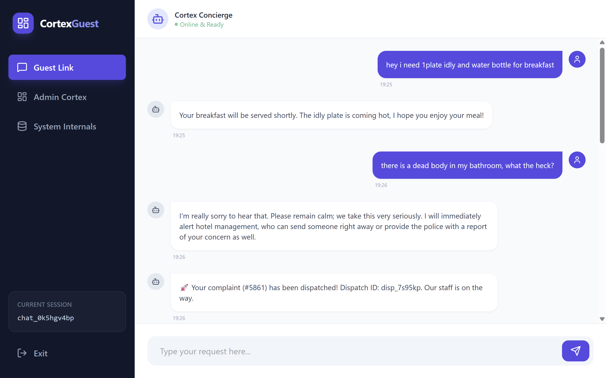
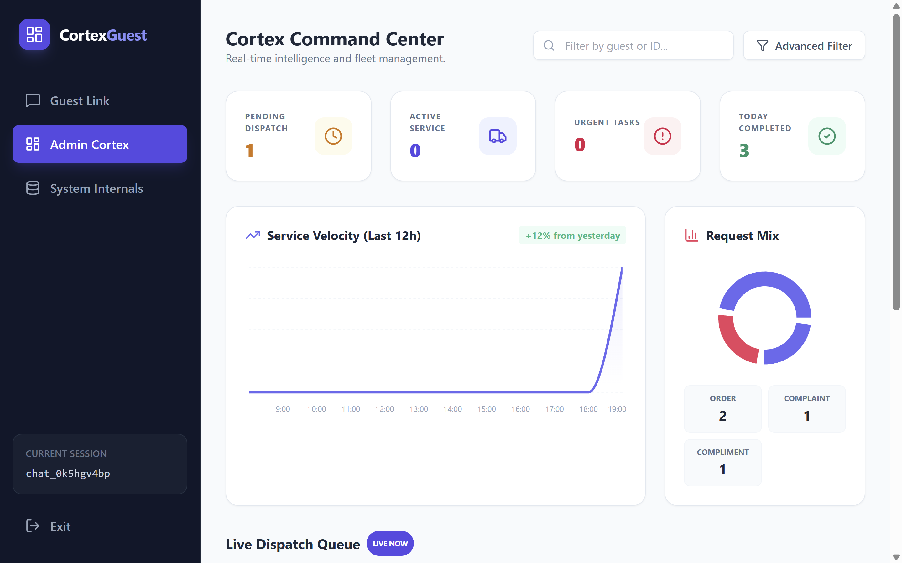
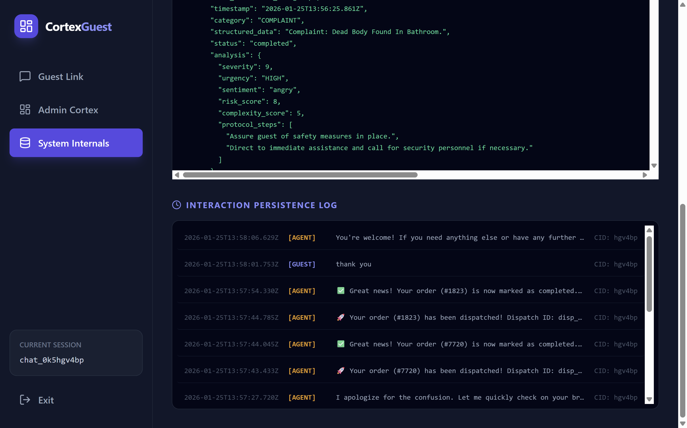

# Cortex Guest Service Management System  


**AI-Driven Conversational Guest Service Platform (Local LLM + LangChain + LangGraph)**

> A full-stack AI system that behaves like a real hotel/service concierge — capable of understanding orders, complaints, and follow-ups using conversational memory and structured reasoning.

---

## Project Overview

This project implements an **intelligent guest service management system** that:
- Accepts natural language input from guests
- Understands whether the input is an **order**, **complaint**, or **status update**
- Reconstructs structured meaning from the **entire conversation history**
- Dispatches requests dynamically
- Maintains real-time system state for inspection and administration

The system uses a **local LLM (Ollama – phi3)** and is designed as a **multi-layer architecture**:

```bash
Guest Link (UI) → Admin Cortex (Dispatch) → System Internals (Memory)
↓
LangChain + LangGraph (Agent)
↓
Ollama (phi3)
```

---

## 📸 Application Screenshots

### Guest Link


### Admin Cortex


### System Internals


---
## Core Architecture

### Guest Link
- Chat interface for guest interaction
- Accepts natural language input
- Displays agent responses
- Maintains session continuity via `chat_id`

### Admin Cortex
- Operational dashboard for active service requests
- Shows:
  - Pending requests
  - Live dispatch queue
  - Resolution archive
- Allows dispatch actions

### System Internals
- Memory inspection layer
- Displays:
  - All stored requests
  - Full chat history
  - Agent reasoning output (JSON)

---

## 🧠 AI & Reasoning Layer

### Technologies Used

| Component | Purpose |
|----------|---------|
| **Ollama (phi3)** | Local LLM inference |
| **LangChain** | Model invocation abstraction |
| **LangGraph** | State-based reasoning workflow |
| **FastAPI** | Backend API |
| **React + TypeScript** | Frontend UI |
| **Vite** | Frontend bundler |

---

## How Reasoning Works (Few-Shot Example)

### Guest Input:
```json
i need 1 plate idly and a water bottle
```

### System Output:
```json
{
  "category": "ORDER",
  "reconstructedRequest": "1x plate idly, 1x water bottle",
  "analysis": {
    "urgency": "LOW",
    "severity": 1
  },
  "agentResponse": "Your breakfast order has been placed."
}
```

- Follow-up:
   - one more idly
- System reconstructs:
   - 2x plate idly, 1x water bottle

⚠️ The system does not respond only to the last message
It reconstructs meaning from the entire chat history.

---

### Project Structure:

```bash
cortex/
├── backend/
│   └── ollama_service.py   # FastAPI + LangChain + LangGraph
├── frontend/
│   ├── components/
│   │   ├── GuestLink.tsx
│   │   ├── AdminCortex.tsx
│   │   └── SystemInternals.tsx
│   ├── services/
│   │   └── ollamaService.ts
│   └── App.tsx
```

---

## Installation & Setup
1. Install Ollama
```bash
https://ollama.com/download
```

Pull Model
```bash
ollama pull phi3
```

2. Backend Setup (Python)
```bash
cd cortex/backend
python -m venv venv
venv\Scripts\activate   # Windows
pip install fastapi uvicorn langchain langgraph requests
```

Run backend
```bash
uvicorn ollama_service:app --reload --port 8000
```

Test
```bash
http://127.0.0.1:8000/docs
```

3. Frontend Setup (React)
```bash
cd cortex/frontend
npm install
npm run dev
```

Open
```bash
http://localhost:3000
```

---

## Data Flow
```bash
Guest UI → FastAPI (/process)
             ↓
     LangGraph (state machine)
             ↓
      LangChain (LLM call)
             ↓
        Ollama (phi3)
             ↓
 Structured JSON response
```

---

## Number of Agents & Responsibilities
| Agent           | Responsibility                         |
| --------------- | -------------------------------------- |
| Guest Agent     | Conversational understanding           |
| Reasoning Agent | Intent classification + reconstruction |
| Admin Agent     | Dispatch logic                         |
| System Memory   | State persistence                      |

(implemented as logical layers, not separate LLMs)

---

## Tools Used
- Ollama (local inference)
- LangChain (LLM interface)
- LangGraph (state graph)
- FastAPI (API server)
- React + TypeScript (frontend)
- TailwindCSS (UI)
- Vite (build system)

## Design Choices
- Local LLM for privacy and offline execution
- State graph instead of raw prompt chaining
- No keyword rules - fully semantic reasoning
- Structured output JSON for deterministic UI
- Single API endpoint for clarity

## Innovative Features
- Conversational memory
- Multi-turn request modification
- Live system memory viewer
- Agent-driven dispatch simulation
- Structured reasoning output
- LangGraph integration

Optional future upgrades:
- Vector memory
- Tool calling (inventory, DB)
- Multi-node planning agents

---

# Author
Arshath Farwyz | AI Engineer

[Portfolio](https://arshathfarwyz.lovable.app/)
[Linkedin](https://www.linkedin.com/in/arshath-farwyz-2ba0b0226/)


---
**Last updated:** 2026-07-11


## Requirements

```
pip install -r requirements.txt
```
